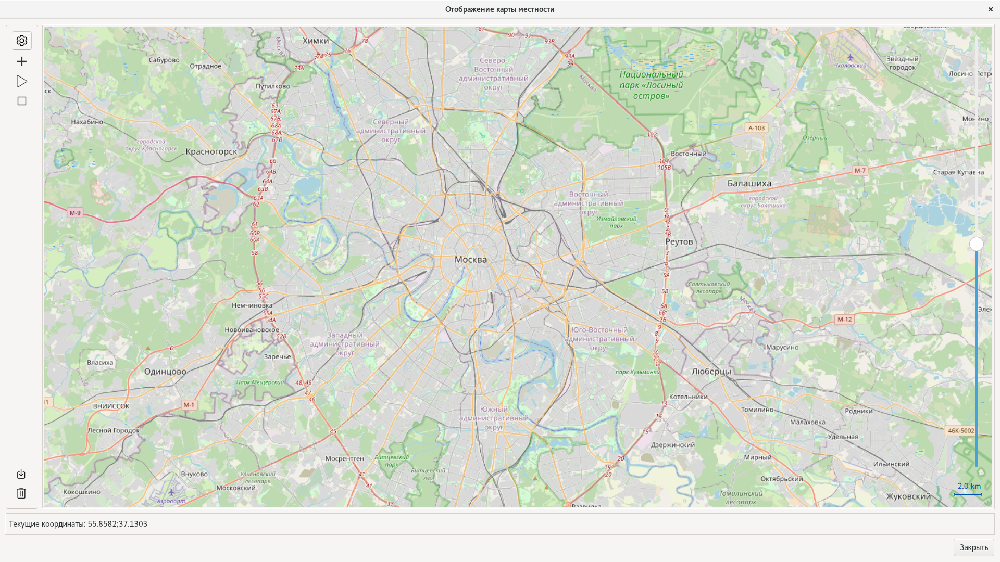
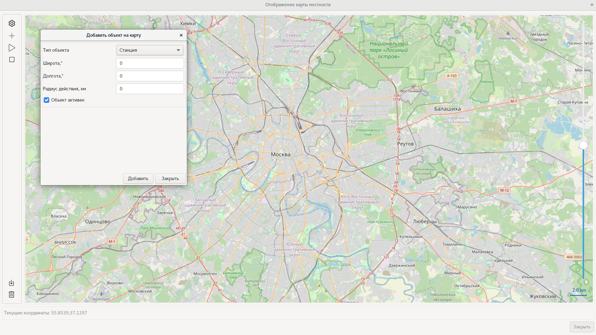
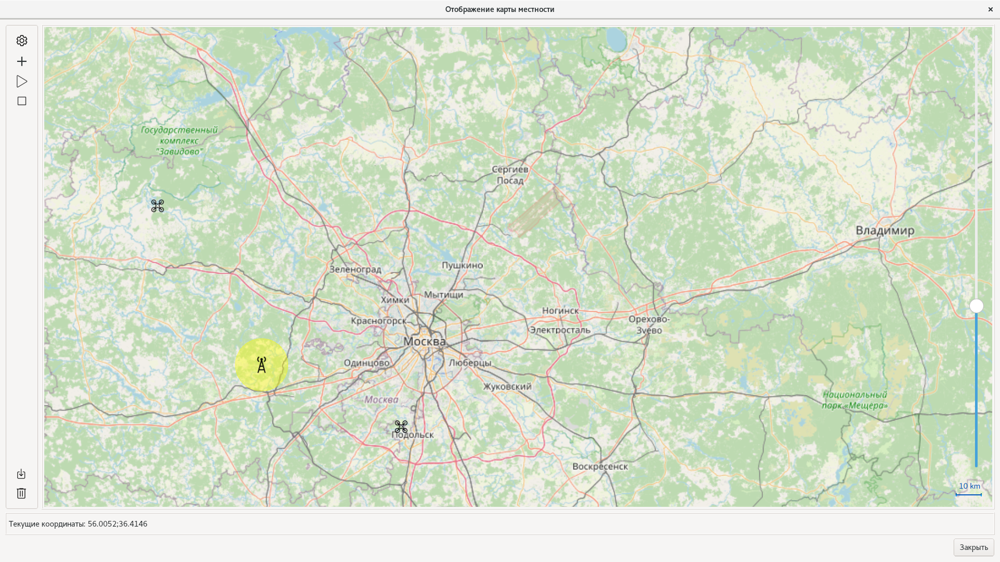

# ShowMap - Система управления объектами на карте

## Описание проекта

ShowMap - это десктопное приложение, разработанное на Qt/C++, предназначенное для размещения, управления и мониторинга различных типов объектов на интерактивных картах. Приложение использует OpenStreetMap для отображения картографических данных и предоставляет богатый функционал для работы с геопространственными объектами.

## Основные возможности

### 🗺️ Картографические функции

- **Интерактивные карты**: Использование OpenStreetMap с поддержкой масштабирования и перемещения
- **Офлайн режим**: Кэширование карт для работы без интернета
- **Многозумирование**: Поддержка различных уровней детализации карты
- **Координатная система**: Отображение координат в реальном времени

### 🎯 Типы поддерживаемых объектов

#### 1. **Станции** (Type 0)

- **Назначение**: Базовые станции связи и управления
- **Характеристики**:
  - Радиус действия (в километрах)
  - Статус активности (активна/неактивна)
  - Визуализация зоны покрытия
- **Функции**:
  - Отображение радиуса действия в виде круга
  - Управление статусом активности
  - Привязка к беспилотникам

#### 2. **Беспилотники** (Type 1)

- **Назначение**: Дроны и квадрокоптеры
- **Характеристики**:
  - Высота полета
  - Уникальный идентификатор
  - Статус активности
  - Привязка к станции управления
- **Функции**:
  - Анимированное перемещение по заданным координатам
  - Drag & Drop для изменения позиции
  - Автоматическое движение по траектории
  - Связь с пультом управления

#### 3. **Пульты управления** (Type 2)

- **Назначение**: Устройства дистанционного управления
- **Характеристики**:
  - Привязка к конкретному беспилотнику
  - Статус активности
- **Функции**:
  - Визуализация связи с беспилотником
  - Управление подчиненными объектами
  - Отображение линий связи

#### 4. **Пеленгаторы** (Type 3)

- **Назначение**: Устройства определения направления
- **Характеристики**:
  - Специализированные функции пеленгации
  - Статус активности

### 🎮 Управление объектами

#### Добавление объектов

- Интуитивный интерфейс для создания новых объектов
- Валидация координат и параметров
- Выбор типа объекта и настройка свойств
- Привязка объектов друг к другу

#### Редактирование и удаление

- Контекстное меню для каждого объекта
- Возможность изменения позиции перетаскиванием
- Удаление объектов с подтверждением
- Редактирование свойств в реальном времени

#### Анимация и движение

- Автоматическое движение беспилотников по заданным траекториям
- Плавные анимации перемещения
- Контроль скорости и направления движения
- Возможность остановки и возобновления движения

### 🎨 Визуализация

#### Иконки и индикаторы

- Уникальные иконки для каждого типа объекта
- Различные состояния (активный/неактивный)
- Цветовая индикация статуса
- Масштабируемые изображения

#### Дополнительные элементы

- Круги радиуса действия для станций
- Линии связи между объектами
- Всплывающие подсказки с информацией
- Статусная строка с координатами

### ⚙️ Технические особенности

#### Архитектура

- **Qt/C++**: Основной фреймворк разработки
- **QML**: Современный интерфейс пользователя
- **QtLocation**: Картографические компоненты
- **QtPositioning**: Работа с геопозиционированием

#### Модель данных

- **MarkerModel**: Управление коллекцией объектов
- **MapMarker**: Представление отдельного объекта
- **QAbstractListModel**: Интеграция с QML

#### Сетевые возможности

- **QNetworkAccessManager**: Загрузка картографических данных
- **Кэширование**: Локальное хранение тайлов карт
- **Офлайн режим**: Работа без интернет-соединения

## Структура проекта

```
showmap-git/
├── main.cpp                 # Точка входа приложения
├── mapwidgettool.h/cpp      # Главное окно приложения
├── markermodel.h/cpp        # Модель данных объектов
├── addobjectform.h/cpp      # Форма добавления объектов
├── slippymap.h/cpp          # Картографический движок
├── mymap.qml               # QML интерфейс карты
├── helper.js               # JavaScript утилиты
├── image/                  # Ресурсы изображений
└── debug/                  # Сборка и кэш карт
```

## Требования к системе

- **ОС**: Linux, Windows, macOS
- **Qt**: Версия 5.15 или выше
- **Компилятор**: Поддержка C++17
- **Зависимости**: QtLocation, QtPositioning, QtQuick

## Сборка и запуск

```bash
# Клонирование репозитория
git clone <repository-url>
cd showmap-git

# Сборка проекта
qmake ShowMap.pro
make

# Запуск приложения
./debug/ShowMap
```

## Использование

1. **Запуск приложения**: Откройте ShowMap
2. **Добавление объектов**: Нажмите кнопку "Добавить" и выберите тип объекта
3. **Настройка параметров**: Введите координаты и другие свойства
4. **Управление**: Используйте контекстные меню для управления объектами
5. **Анимация**: Запустите движение объектов кнопкой "Play"

## Скриншоты

### Главное окно приложения



Основной интерфейс приложения с интерактивной картой. На карте отображены:

- Множественные объекты (станции) с красными маркерами и номерами
- Линии связи между объектами
- Зоны покрытия (зеленые круги)
- Текущие координаты курсора
- Панель инструментов слева

### Добавление нового объекта



Модальное окно для создания нового объекта на карте с полями:

- Выбор типа объекта (Станция, Беспилотник, Пульт управления, Пеленгатор)
- Ввод координат (широта, долгота)
- Настройка радиуса действия
- Управление статусом активности

### Отображение различных типов объектов



Демонстрация различных типов объектов:

- **Станция** (желтый круг с буквой "A") - базовая станция связи
- **Беспилотники** (иконки с пропеллерами) - группы дронов в разных районах
- Зоны покрытия и связи между объектами
- Масштабирование карты (10 км)

## Технологии

- **Qt 5.15+** - Основной фреймворк
- **C++17** - Язык программирования
- **QML** - Декларативный UI
- **OpenStreetMap** - Картографические данные
- **QtLocation** - Картографические компоненты

## Архитектурные возможности

### Модульность и переиспользование

ShowMap разработан с учетом принципов модульной архитектуры, что позволяет использовать его компоненты в составе более крупных приложений:

#### 🧩 Картографический виджет

Основной картографический компонент (`MapWidgetTool`) может быть интегрирован как отдельный виджет в:

- **Системы мониторинга**: Центры управления в реальном времени
- **ГИС-приложения**: Геоинформационные системы для анализа данных
- **Системы безопасности**: Мониторинг и управление объектами безопасности
- **Логистические платформы**: Отслеживание транспорта и маршрутов
- **Управляющие панели**: Дашборды для контроля различных процессов

#### 🎯 Преимущества интеграции

- **Готовые решения**: Не требует разработки картографических компонентов с нуля
- **Гибкость настройки**: Легкая адаптация под специфические требования
- **Производительность**: Оптимизированные алгоритмы отображения и управления
- **Расширяемость**: Возможность добавления новых типов объектов и функций
- **Кроссплатформенность**: Работа на всех поддерживаемых Qt платформах

#### 📋 Примеры использования в корпоративных системах

- **Системы управления беспилотниками**: Мониторинг флота дронов
- **Инфраструктурные проекты**: Управление сетями связи и энергоснабжения
- **Транспортные системы**: Отслеживание общественного транспорта
- **Экологический мониторинг**: Контроль состояния окружающей среды
- **Системы безопасности**: Управление камерами наблюдения и датчиками

## Лицензия

Проект использует компоненты Qt под лицензией LGPL v2.1.

---

**Разработчик**: Наталья Губарь ([@ng_webdesign](https://t.me/ng_webdesign))  
**Версия**: 1.0  
**Дата**: 2024
